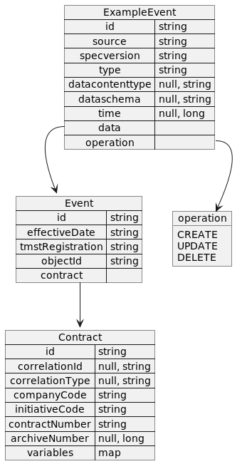

# avsc2uml

Stop struggling while reading those long messy AVRO schema files.

Transform the schemas in a plantuml easy readable diagram with avsc2uml.

Example usage: 
> avsc2uml --avro-schema-file=src/test/resources/generic-schema.avsc --output-file=generic-schema.puml

The following example rapresents the plantuml schema resulting from the file generic-schema.avsc located in test resources:

## Build

The project can generate a standard standalone jar using the command
> mvn package

or it can generate a native executable with GraalVM and GraalVM Native
> mvn package -Pnative

## References

GraalVM installation:
* https://www.graalvm.org/22.0/docs/getting-started/#install-graalvm
* https://www.graalvm.org/latest/reference-manual/native-image/#install-native-image
